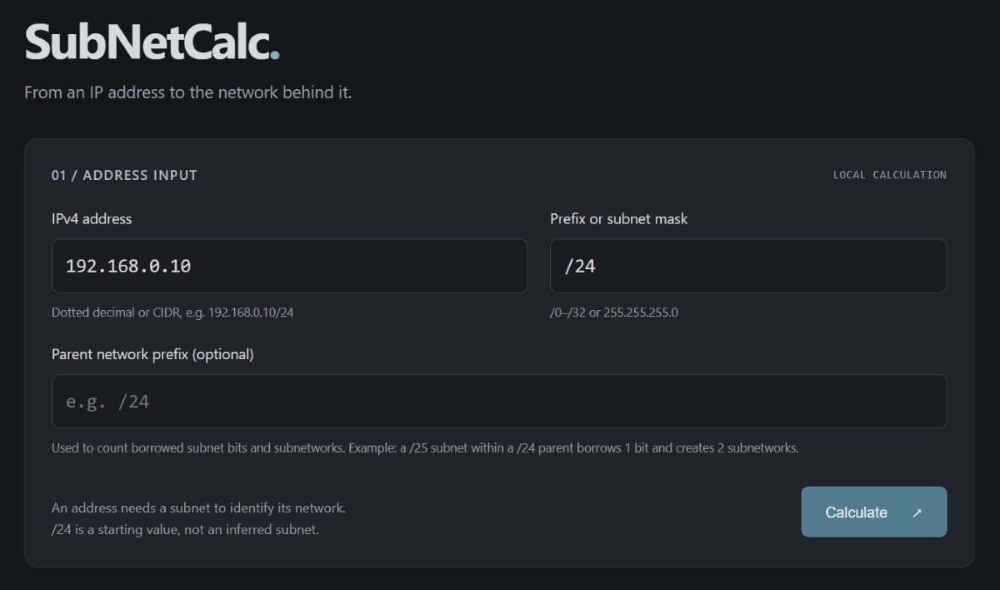

# SubNetCalc

[](https://developer.mozilla.org/en-US/docs/Web/JavaScript)
[](#)
[](https://github.com/JohnB-LWF/SubNetCalc/stargazers)

SubNetCalc is a dependency-free IPv4 subnet calculator. Enter an IP address and a prefix or subnet mask to see which network it belongs to, how the address and mask combine bit by bit, and how many addresses the subnet contains. It runs entirely in your browser: no address data is sent to a server.



## Features

- **Flexible input:** enter an IPv4 address with a separate prefix (`24` or `/24`) or contiguous dotted-decimal subnet mask (`255.255.255.0`). CIDR notation such as `192.168.0.10/24` is also accepted; its prefix takes precedence and updates the prefix field after calculation.
- **Network overview:** shows the network in CIDR notation, subnet mask, network address, and broadcast address where applicable.
- **Bitwise explanation:** displays the IP address, mask, and network address in binary to illustrate the AND operation used to find the network.
- **Address details:** includes the original IP in dotted decimal, hexadecimal and unsigned decimal, wildcard mask, usable address range, and total and usable address counts.
- **Subnet planning:** optionally provide a parent network prefix to see the number of borrowed bits and how many subnets of the entered size fit within that prefix.
- **Responsive, accessible interface:** a dark layout adapts to small screens, binary output can scroll horizontally, results are announced to assistive technology, and decode animation respects the system's reduced-motion preference.
- **Local and lightweight:** plain HTML, CSS, and JavaScript; no dependencies, build step, or backend.

## Use

The calculator starts with the example address `192.168.0.10` and prefix `/24`. Replace these with the address and subnet you want to calculate, then click **Calculate** or press Enter. An address alone cannot determine its network, so `/24` is just an initial example and is not inferred from the address.

For subnet planning, enter a parent prefix as well. For example, a `/25` subnet with a `/24` parent borrows one bit, yielding `2¹ = 2` subnets; each `/25` contains 128 total addresses and 126 usable host addresses. The parent field takes a prefix only; it calculates subnet counts but does not check whether a particular subnet address belongs to a specific parent network. Leave it blank if you do not need subnet counts.

## Run now

Try the live app at [subnetcalc.onrender.com](https://subnetcalc.onrender.com/).

### Input and calculation notes

- IPv4 addresses must contain four decimal octets from 0 to 255. Leading-zero octets are rejected to avoid ambiguous interpretation.
- Prefix lengths from `/0` through `/32` and contiguous subnet masks are supported. Non-contiguous masks are rejected.
- `/31` is treated as a point-to-point link: both addresses are usable, and there is no broadcast address.
- `/32` represents a single-host route, with no broadcast address.
- For other prefix lengths, the usable range and host count exclude the network and broadcast addresses.
- Results describe IPv4 address arithmetic only; they do not indicate whether an address is assigned, configured, or reachable.

## Run locally

Open `index.html` directly in a browser, or serve the directory with Python:

```powershell
python -m http.server 8000 --bind 127.0.0.1
```

Then visit <http://localhost:8000>. To deploy, serve `index.html`, `styles.css`, `ipv4.js`, and `app.js` from any static web server. No build step or backend is needed.

## Verify calculation logic

With Node.js installed, run:

```powershell
node --test tests/ipv4.test.cjs
```

ChatGPT Astra (light) was used as part of the workflow during the creation of this application.
